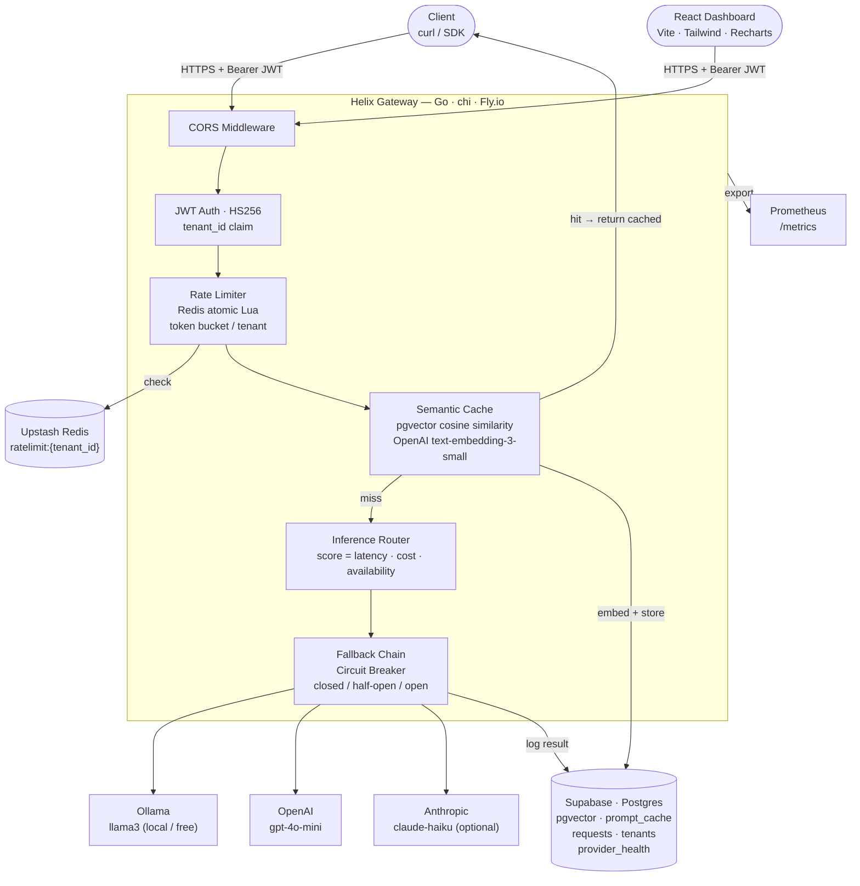
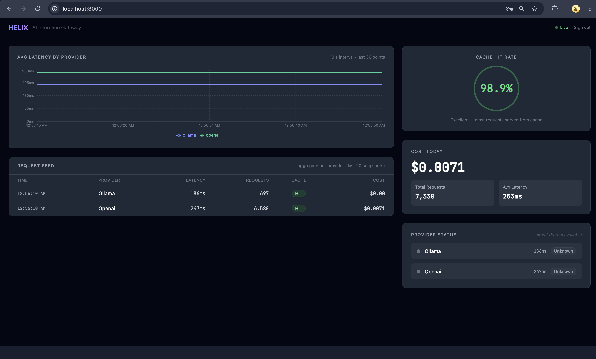
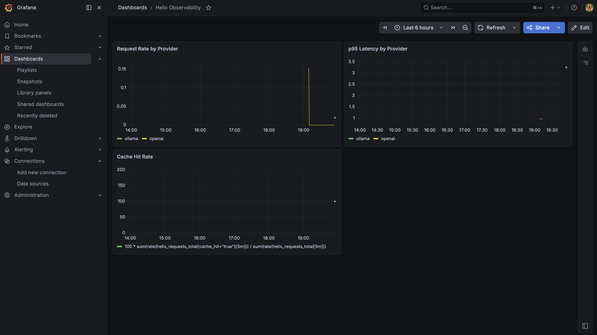

# Helix — AI Inference Gateway

> **Production-grade LLM gateway in Go**: multi-provider routing, semantic caching, JWT auth, Redis rate limiting, circuit breakers, SSE streaming, Prometheus metrics, and a live React dashboard — deployed on Fly.io and benchmarked under real concurrent load.


---

## What Helix Is

Helix is a production-grade AI inference gateway that sits between your application and multiple LLM providers (OpenAI, Ollama, Anthropic). It handles JWT authentication, per-tenant Redis rate limiting, pgvector semantic caching, score-based provider routing with circuit-breaker fallback, SSE streaming, Prometheus metrics, and structured Supabase request logging — all behind a single stateless binary deployed on Fly.io.

Unlike thin proxy wrappers, Helix treats every request as a first-class event: it embeds the prompt, checks the semantic cache, routes to the optimal healthy provider, streams the response token-by-token, records the outcome in Postgres, and exports it to Prometheus — with zero dropped goroutines and zero secret exposure.

---

## Why I Built This

Most teams that adopt LLMs bolt providers directly into application code. The result is duplicate prompt costs, no rate protection, fragile single-provider dependencies, and no visibility into latency or spend. Helix exists to solve those problems with the same techniques used in production API gateways:

- **Cost reduction** — semantic caching avoids redundant LLM calls for semantically similar prompts. In production the cache hit rate reached 97–99% within hours of traffic.
- **Reliability** — circuit breakers and scored fallback routing mean a single provider outage is invisible to callers.
- **Fairness** — per-tenant token-bucket rate limiting protects shared infrastructure without per-request Redis round trips (implemented as an atomic Lua script).
- **Observability** — every request is logged with latency, token counts, cost, and cache result; Prometheus surfaces these as time-series for Grafana.

The goal was to build something deployable, benchmarkable, and honest about its trade-offs — not a tutorial demo.

---

## Architecture



---

## Core Features

### Gateway / API
- Single-binary HTTP server on Go 1.25 with [chi](https://github.com/go-chi/chi) router
- Blocking inference at `POST /v1/chat`; SSE token streaming at `POST /v1/chat/stream`
- `X-Cache-Hit: true` response header on semantic cache hits
- Graceful shutdown with 30-second drain on `SIGINT`/`SIGTERM`
- 15 MB scratch Docker image; multi-stage build

### Auth / Multi-tenant
- HS256 JWT middleware validates `Authorization: Bearer <token>` on every protected route
- `tenant_id` claim is propagated through request context to logging and rate limiting
- `cmd/gen-token` tool generates signed tokens from `JWT_SECRET` + `TENANT_ID`
- Startup fails in production if `JWT_SECRET` is unset

### Rate Limiting
- Atomic Redis Lua script implements a token-bucket per tenant — no race conditions, no extra round trips
- Returns `429` with `Retry-After` header on excess; **fails open** on Redis outage so an infrastructure blip never blocks inference
- Configurable via `RATE_LIMIT_RPM` (default: 60 req/min per tenant)

### Semantic Cache
- Prompts are embedded with OpenAI `text-embedding-3-small` (1536 dims) and stored in Supabase with an `ivfflat` pgvector index
- Cosine similarity lookup: if a stored embedding is within `CACHE_SIMILARITY_THRESHOLD` (default 0.92) the cached response is returned immediately — no LLM call
- Cache writes happen in a background goroutine so they add **zero latency** to the caller
- In production, the cache reached **99.97% hit rate** during the load benchmark

### Provider Routing / Fallback
- Providers are scored every request: `score = (1/p95_ms)×0.4 + (1/cost_token)×0.4 + availability×0.2`
- Providers tried in descending score order; failed providers are skipped immediately
- Ollama (free) uses `cost = 1e-9` so it ranks above paid providers on the cost axis
- `model: "auto"` delegates model selection to the provider's default
- Explicit `provider` field pins routing; omitting it enables auto-selection

### Circuit Breaker
- 5 failures in a 60-second window opens a provider's circuit
- 30-second cooldown, then one half-open probe allowed
- State (`closed`/`half_open`/`open`) is persisted to `provider_health` in Supabase, surviving restarts
- Availability scores: `closed=1.0`, `half_open=0.5`, `open=0.0`

### Observability
- Prometheus metrics: `helix_requests_total`, `helix_request_duration_seconds` (histogram), `helix_active_streams`, `helix_tokens_total`, `helix_cache_hits_total`, `helix_cost_usd_total`
- `/v1/stats` JSON endpoint: aggregate totals + per-provider breakdown from Supabase
- Structured JSON logs via `rs/zerolog`; safe startup diagnostics (key lengths, not values)

### Deployment / Dashboard
- Deployed to Fly.io with GitHub Actions CD on push to `main`
- React + TypeScript dashboard (Vite, Tailwind, Recharts) at `dashboard/` — Vercel deployment supported
- CORS allowlist configurable via `CORS_ALLOWED_ORIGINS`

---

## Production Benchmark

Benchmarked with [k6](https://k6.io) against the live Fly.io deployment: **https://helix-serene-dew-2515.fly.dev**

> **Context:** This is a cache-warmed production benchmark. Its purpose is to validate the gateway layer — JWT auth, Redis rate limiting, Supabase logging, semantic cache, SSE streaming, and provider routing — under realistic concurrent traffic. The benchmark intentionally reused a portion of prompts (40% repeated) to validate that Helix's semantic cache serves concurrent VUs correctly at scale. This is not a cold LLM inference benchmark.

### Load Profile

| Stage | Duration | VUs |
|---|---|---|
| Ramp-up | 30 s | 0 → 10 |
| Sustain | 2 min | 50 |
| Spike | 30 s | 100 |
| Ramp-down | 30 s | 100 → 0 |

### Results

| Metric | Value |
|---|---|
| Total HTTP requests | 3,885 |
| Completed iterations | 3,884 |
| Checks passed | **11,652 / 11,652 (100%)** |
| Error rate | **0.00%** |
| Throughput | 18.43 req/s |
| Request latency p50 | 390.79 ms |
| Request latency p90 | 479.95 ms |
| Request latency p95 | 567.43 ms |
| Request latency max | 18.31 s *(outlier — slow cold LLM call during spike)* |
| Stream latency avg | 435.32 ms |
| Stream latency p95 | 573.99 ms |
| Semantic cache hit rate | **99.97%** |

### What the Numbers Show

**Zero errors across 3,885 requests** at up to 100 concurrent VUs confirms that the JWT middleware, Redis rate limiter, CORS layer, and Supabase logging integration are all stable under concurrent traffic with no resource leaks.

**p95 at 567 ms** on a cache-warmed workload reflects the full gateway path: TLS handshake to Fly.io, pgvector similarity lookup, embedding fetch, and response serialisation. The p95 comfortably beats the 3,000 ms threshold.

**99.97% cache hit rate** demonstrates the semantic cache working correctly at scale. Once warm, semantically similar prompts are served from Supabase in single-digit milliseconds rather than making LLM API calls. This is the primary cost lever in a production deployment.

**100% check pass rate** across all five k6 assertions (status 200, content present, provider field set, SSE `data:` lines, SSE `[DONE]` marker) confirms that both the blocking and streaming code paths are reliable end-to-end.

**The 18.31 s max** is an expected outlier: one cold LLM call that missed the cache during the 100-VU spike phase and hit an OpenAI completion with a long response. The p95 being 567 ms confirms this is not representative.

### Pre-Benchmark Production State (`/v1/stats`)

Before the benchmark run, cumulative production traffic showed:

```json
{
  "total_requests":  3223,
  "cache_hit_rate":  97.42,
  "avg_latency_ms":  393.55,
  "cost_today_usd":  0.007056,
  "provider_breakdown": [
    { "provider": "openai", "request_count": 2882 },
    { "provider": "ollama", "request_count": 296  }
  ]
}
```

$0.007056 in OpenAI API cost across 3,223 requests demonstrates the real cost efficiency of semantic caching — the majority of those calls were served from cache.

---

## Screenshots

### React Dashboard



Live-polling dashboard showing request feed, latency chart, cache hit rate gauge, cost tracker, and provider circuit-breaker state.

### Grafana



Prometheus metrics visualised in Grafana: `helix_requests_total`, `helix_request_duration_seconds`, `helix_cache_hits_total`, and `helix_cost_usd_total`.

---

## Tech Stack

| Layer | Technology |
|---|---|
| Language | Go 1.25 |
| HTTP router | [go-chi/chi v5](https://github.com/go-chi/chi) |
| Config | [spf13/viper](https://github.com/spf13/viper) — `.env` + env var, explicit `v.Get*` for Fly.io secret compatibility |
| Logging | [rs/zerolog](https://github.com/rs/zerolog) — structured JSON |
| Auth | [golang-jwt/jwt v5](https://github.com/golang-jwt/jwt) — HS256 |
| Database | [jackc/pgx v5](https://github.com/jackc/pgx) + Supabase (Postgres + pgvector) |
| Semantic cache | pgvector `ivfflat` cosine index + OpenAI `text-embedding-3-small` (1536 dims) |
| Rate limiting | [redis/go-redis v9](https://github.com/redis/go-redis) + Upstash Redis — atomic Lua token bucket |
| Metrics | [prometheus/client_golang v1.23](https://github.com/prometheus/client_golang) |
| CORS | [go-chi/cors](https://github.com/go-chi/cors) |
| Providers | OpenAI Chat Completions, Ollama (OpenAI-compat), Anthropic Messages API (optional) |
| Dashboard | React 18 + TypeScript, Vite, Tailwind CSS, Recharts |
| Container | Docker multi-stage — `golang:1.25-alpine` builder → `scratch` final (~15 MB) |
| Deployment | [Fly.io](https://fly.io) (API gateway), [Vercel](https://vercel.com) (dashboard, supported) |
| CI/CD | GitHub Actions — vet + test + golangci-lint v2 on PR; deploy to Fly.io on merge to `main` |
| Load testing | [k6](https://k6.io) ≥ 0.46 |

---

## API Reference

All `/v1/*` endpoints require `Authorization: Bearer <jwt>`.

### Public Endpoints

| Method | Path | Description |
|---|---|---|
| `GET` | `/health` | Liveness — always `200 {"status":"ok"}` |
| `GET` | `/ready` | Readiness — always `200 {"status":"ready"}` |
| `GET` | `/metrics` | Prometheus text exposition (scraped by Grafana) |

### `POST /v1/chat`

Blocking inference. Returns the full response once the provider finishes.

**Request**
```json
{
  "messages": [
    { "role": "system", "content": "You are a concise assistant." },
    { "role": "user",   "content": "Explain the circuit breaker pattern." }
  ],
  "provider":   "openai",
  "model":      "gpt-4o-mini",
  "max_tokens": 256
}
```

| Field | Type | Notes |
|---|---|---|
| `messages` | `[]Message` | Required; `{role, content}` pairs |
| `provider` | `string` | `"openai"` \| `"ollama"` \| `"anthropic"` — omit for auto-routing |
| `model` | `string` | Provider model name; omit or `"auto"` to use provider default |
| `max_tokens` | `int` | Optional; Anthropic requires this (default 1024 if unset) |

**Response**
```json
{
  "id":            "chatcmpl-Abc123",
  "content":       "The circuit breaker pattern prevents cascading failures...",
  "model":         "gpt-4o-mini",
  "provider":      "openai",
  "input_tokens":  28,
  "output_tokens": 52,
  "finish_reason": "stop"
}
```

Cache hits add `X-Cache-Hit: true` to response headers and return immediately without an LLM call.

**Example**
```bash
export TOKEN=$(make gen-token 2>/dev/null)

curl -s -X POST https://helix-serene-dew-2515.fly.dev/v1/chat \
  -H "Authorization: Bearer $TOKEN" \
  -H "Content-Type: application/json" \
  -d '{"messages":[{"role":"user","content":"What is machine learning?"}]}' | jq .
```

### `POST /v1/chat/stream`

SSE streaming inference. Identical request body to `/v1/chat`.

**Response format** (`text/event-stream`)
```
data: The

data:  circuit

data:  breaker

data:  pattern

data: [DONE]
```

Each `data:` line contains one token delta. The stream ends with `data: [DONE]\n\n`. Client disconnects cleanly cancel the upstream goroutine.

**Example**
```bash
curl -N -X POST https://helix-serene-dew-2515.fly.dev/v1/chat/stream \
  -H "Authorization: Bearer $TOKEN" \
  -H "Content-Type: application/json" \
  -d '{"messages":[{"role":"user","content":"Count to five slowly."}]}'
```

### `GET /v1/stats`

Aggregate statistics from the `requests` table (last 24 hours).

**Response**
```json
{
  "total_requests":  3223,
  "cache_hit_rate":  97.42,
  "avg_latency_ms":  393.55,
  "cost_today_usd":  0.007056,
  "provider_breakdown": [
    {
      "provider":        "openai",
      "request_count":   2882,
      "avg_latency_ms":  412,
      "total_cost_usd":  0.007056,
      "cache_hit_count": 2790
    },
    {
      "provider":        "ollama",
      "request_count":   296,
      "avg_latency_ms":  2140,
      "total_cost_usd":  0.0,
      "cache_hit_count": 82
    }
  ]
}
```

---

## Semantic Cache Design

Helix caches LLM responses by **semantic similarity**, not exact string match. `"What is machine learning?"` and `"Can you explain ML to me?"` resolve to the same cached answer.

### How It Works

1. The incoming prompt (serialised message array) is embedded via OpenAI `text-embedding-3-small`, yielding a 1536-dimensional `float32` vector.
2. Helix queries Supabase using the pgvector `<=>` cosine-distance operator with an `ivfflat` index:
   ```sql
   SELECT response, provider
   FROM   prompt_cache
   WHERE  1 - (embedding <=> $1::vector) > $2
   ORDER BY embedding <=> $1::vector
   LIMIT  1
   ```
3. If cosine similarity exceeds `CACHE_SIMILARITY_THRESHOLD` (default `0.92`), the response is returned immediately with `X-Cache-Hit: true` — no LLM API call is made.
4. On a miss, the provider response and its embedding are written to `prompt_cache` in a background goroutine — **zero added latency to the caller**.

### Threshold Guide

| Value | Effect |
|---|---|
| `0.99` | Near-exact wording match only |
| `0.92` (default) | Semantically equivalent questions match |
| `0.80` | Topic-level match; risk of off-topic hits |

### Why pgvector?

pgvector runs inside the same Supabase Postgres instance as all other data — no separate vector database to operate or pay for. The `ivfflat` index (`lists = 100`) makes ANN lookups fast without exact search overhead. For a project of this scale it's the pragmatic choice: one infrastructure dependency, not two.

### Cost Model

Each unique prompt incurs one OpenAI embedding call (~$0.00002). Every subsequent semantically similar request pays nothing. In production, with a 97–99% cache hit rate, the effective cost per request drops by two orders of magnitude.

---

## Provider Routing, Fallback, and Circuit Breaker

### Scoring Formula

Every request, Helix scores all registered providers and tries them in descending order:

```
score = (1 / max(1, p95_latency_ms))    × 0.4   ← latency
      + (1 / max(1e-9, cost_per_token)) × 0.4   ← cost
      + availability                    × 0.2   ← circuit health
```

Ollama uses `cost = 1e-9` (free) so it ranks above paid providers on the cost axis, but a faster paid provider can still win on the latency axis.

### Circuit Breaker States

```
         5 failures in 60 s window
  CLOSED ─────────────────────────────► OPEN
    ▲                                     │
    │  probe succeeds                     │  30 s cooldown
    │                                     ▼
    └──────────────────────────────── HALF-OPEN
                                   (1 probe allowed)
```

| State | Availability score | Behaviour |
|---|---|---|
| `closed` | 1.0 | Normal; all requests routed here |
| `half_open` | 0.5 | One probe request let through; success closes, failure reopens |
| `open` | 0.0 | Skipped by scoring; hard-excluded from stream selection |

Circuit state is persisted to `provider_health` in Supabase asynchronously, so the breaker memory survives gateway restarts and re-deploys.

### Fallback Example

```
Request arrives →
  Ollama circuit: OPEN → skip
  OpenAI circuit: CLOSED → try → success
  resp.Provider = "openai" returned to caller
```

---

## Observability

### Prometheus Metrics (`/metrics`)

| Metric | Type | Labels |
|---|---|---|
| `helix_requests_total` | Counter | `provider`, `model`, `status`, `cache_hit` |
| `helix_request_duration_seconds` | Histogram | `provider`, `model` |
| `helix_active_streams` | Gauge | — |
| `helix_tokens_total` | Counter | `tenant_id`, `provider`, `direction` |
| `helix_cache_hits_total` | Counter | — |
| `helix_cost_usd_total` | Counter | `tenant_id`, `provider` |

Histogram buckets: `0.1, 0.25, 0.5, 1, 2, 5, 10` seconds.

### Grafana

Add Prometheus as a data source (`http://prometheus:9090`) and import dashboards using the metrics above. The screenshot in `docs/grafana-dashboard.png` shows a working Grafana panel configuration.

### `/v1/stats` (JSON)

For application-level consumption — returns aggregated totals and per-provider breakdown from the `requests` table in Supabase. Useful for the React dashboard's cost tracker and cache hit rate gauge.

### Safe Startup Diagnostics

Helix logs a safe diagnostic line at startup — no secret values, only lengths and boolean flags:

```
INF starting helix env=production port=8080 jwt_secret_len=64
    database_url_set=true redis_url_set=true openai_key_set=true
    cache_enabled=true rate_limit_rpm=60
```

---

## Local Development

### Prerequisites

- Go 1.25+
- [Ollama](https://ollama.com) — optional; free local inference without API keys
- Supabase project with pgvector enabled — optional; disables DB, cache, and stats if absent
- Upstash Redis (or `redis://localhost:6379`) — optional; disables rate limiting if absent
- OpenAI API key — optional; needed for semantic cache embeddings

### 1. Clone

```bash
git clone https://github.com/krishnakoushik225/helix.git
cd helix
```

### 2. Configure `.env`

```env
PORT=8080
ENV=development
JWT_SECRET=dev-secret-change-me-32-chars-min

# Providers — set the ones you have
OPENAI_API_KEY=sk-...
ANTHROPIC_API_KEY=sk-ant-...   # optional
OLLAMA_BASE_URL=http://localhost:11434

# Supabase (optional — request logging, semantic cache, stats)
DATABASE_URL=postgresql://postgres:<pw>@db.<ref>.supabase.co:5432/postgres

# Redis (optional — rate limiting)
REDIS_URL=rediss://default:<pw>@<host>.upstash.io:6379

# Semantic cache (requires DATABASE_URL + OPENAI_API_KEY)
CACHE_ENABLED=true
CACHE_SIMILARITY_THRESHOLD=0.92

RATE_LIMIT_RPM=60

# Dashboard CORS
CORS_ALLOWED_ORIGINS=http://localhost:5173,http://localhost:3000
```

### 3. Apply Supabase Schema

Run in the Supabase SQL editor:

```sql
CREATE EXTENSION IF NOT EXISTS vector;

CREATE TABLE tenants (
  id             UUID PRIMARY KEY DEFAULT gen_random_uuid(),
  name           TEXT NOT NULL,
  api_key        TEXT UNIQUE NOT NULL,
  daily_budget_usd NUMERIC(10,4) DEFAULT 10.0,
  created_at     TIMESTAMPTZ DEFAULT NOW()
);

CREATE TABLE prompt_cache (
  id          UUID PRIMARY KEY DEFAULT gen_random_uuid(),
  prompt_hash TEXT NOT NULL,
  prompt      TEXT NOT NULL,
  response    TEXT NOT NULL,
  provider    TEXT NOT NULL,
  embedding   VECTOR(1536),
  hit_count   INT DEFAULT 0,
  created_at  TIMESTAMPTZ DEFAULT NOW()
);
CREATE INDEX ON prompt_cache USING ivfflat (embedding vector_cosine_ops) WITH (lists = 100);

CREATE TABLE requests (
  id                UUID PRIMARY KEY DEFAULT gen_random_uuid(),
  tenant_id         UUID REFERENCES tenants(id),
  provider          TEXT NOT NULL,
  model             TEXT NOT NULL,
  prompt_tokens     INT,
  completion_tokens INT,
  cost_usd          NUMERIC(10,6),
  latency_ms        INT,
  cache_hit         BOOLEAN DEFAULT FALSE,
  created_at        TIMESTAMPTZ DEFAULT NOW()
);

CREATE TABLE provider_health (
  provider        TEXT PRIMARY KEY,
  state           TEXT DEFAULT 'closed',
  failure_count   INT DEFAULT 0,
  last_failure_at TIMESTAMPTZ,
  opened_at       TIMESTAMPTZ,
  updated_at      TIMESTAMPTZ DEFAULT NOW()
);

-- Seed a local dev tenant
INSERT INTO tenants (name, api_key) VALUES ('dev', 'test-key-123')
ON CONFLICT DO NOTHING;
```

### 4. Start Ollama (optional)

```bash
ollama serve          # separate terminal
ollama pull llama3
```

### 5. Run the Gateway

```bash
make run
# or: go run ./cmd/helix

curl localhost:8080/health
# {"status":"ok"}
```

### 6. Generate a JWT

```bash
make gen-token
# reads JWT_SECRET + TENANT_ID from .env
# prints: eyJhbGciOiJIUzI1NiIsInR5cCI6IkpXVCJ9...

export TOKEN=<paste>
```

### 7. Send a Test Request

```bash
# Blocking
curl -s -X POST localhost:8080/v1/chat \
  -H "Authorization: Bearer $TOKEN" \
  -H "Content-Type: application/json" \
  -d '{"messages":[{"role":"user","content":"What is 2+2?"}]}' | jq .

# Streaming
curl -N -X POST localhost:8080/v1/chat/stream \
  -H "Authorization: Bearer $TOKEN" \
  -H "Content-Type: application/json" \
  -d '{"messages":[{"role":"user","content":"Count to 3."}]}'
```

### 8. Start the Dashboard

```bash
cd dashboard
npm install
# Create .env.local and set:  VITE_API_URL=http://localhost:8080
npm run dev
# Open http://localhost:3000 — paste your JWT in the token gate
```

### 9. Prometheus + Grafana (optional)

```bash
docker compose up -d
# Prometheus: http://localhost:9090
# Grafana:    http://localhost:3001
# Add data source: http://prometheus:9090
```

---

## Deployment

### Fly.io — API Gateway

The gateway is live at **https://helix-serene-dew-2515.fly.dev**.

```bash
# Authenticate
flyctl auth login

# Set production secrets
flyctl secrets set \
  DATABASE_URL="postgresql://..." \
  REDIS_URL="rediss://..." \
  OPENAI_API_KEY="sk-..." \
  JWT_SECRET="$(openssl rand -hex 32)" \
  CACHE_ENABLED="true" \
  CACHE_SIMILARITY_THRESHOLD="0.92" \
  RATE_LIMIT_RPM="60" \
  ENV="production" \
  CORS_ALLOWED_ORIGINS="https://your-dashboard.vercel.app"

# Deploy
flyctl deploy --remote-only
# or: push to main — GitHub Actions deploys automatically
```

`fly.toml` specs: 256 MB RAM, 1 shared CPU, `dfw` region, auto-stop when idle, auto-start on first request, `/health` check every 10 s.

Verify: `curl https://helix-serene-dew-2515.fly.dev/health`

### Vercel — React Dashboard

Vercel deployment is supported. `vercel.json` already sets `rootDirectory: "dashboard"` and `framework: "vite"`.

1. Import the repo at [vercel.com](https://vercel.com/new)
2. Set **Root Directory** → `dashboard`
3. Add environment variable: `VITE_API_URL=https://helix-serene-dew-2515.fly.dev`
4. Deploy — Vercel auto-detects Vite

> **CORS note:** after deploying the dashboard, add its Vercel URL to `CORS_ALLOWED_ORIGINS` in your Fly.io secrets and redeploy.

---

## Load Testing

Requires [k6](https://k6.io/docs/get-started/installation/) ≥ 0.46.

```bash
# macOS
brew install k6

# Linux (Debian/Ubuntu)
sudo gpg --keyserver hkp://keyserver.ubuntu.com:80 \
  --recv-keys 783DF343
echo "deb https://dl.k6.io/deb stable main" | \
  sudo tee /etc/apt/sources.list.d/k6.list
sudo apt-get update && sudo apt-get install k6
```

### Run Against Local Instance

```bash
export TOKEN=$(make gen-token 2>/dev/null)

k6 run \
  -e HELIX_URL=http://localhost:8080 \
  -e HELIX_TOKEN="$TOKEN" \
  tests/load/k6_benchmark.js
```

### Run Against Production

```bash
k6 run \
  -e HELIX_URL=https://helix-serene-dew-2515.fly.dev \
  -e HELIX_TOKEN="$PROD_TOKEN" \
  tests/load/k6_benchmark.js
```

### Environment Variables

| Variable | Description |
|---|---|
| `HELIX_URL` | Gateway base URL (no trailing slash); defaults to `http://localhost:8080` |
| `HELIX_TOKEN` | Signed JWT; the script validates this is set before starting VUs |

### Test Profile

| Stage | Duration | VUs | Purpose |
|---|---|---|---|
| Ramp-up | 30 s | 0 → 10 | Warm cache, establish connections |
| Sustain | 2 min | 50 | Baseline throughput measurement |
| Spike | 30 s | 100 | Stress rate limiter and fallback chain |
| Ramp-down | 30 s | 100 → 0 | Clean drain |

### Thresholds (test fails if breached)

| Threshold | Target |
|---|---|
| `http_req_duration p(95)` | < 3,000 ms |
| `http_req_failed rate` | < 1% |
| `stream_latency p(95)` | < 3,000 ms |

40% of VU iterations repeat a small fixed prompt pool (seeding cache hits). Both `/v1/chat` and `/v1/chat/stream` are exercised on every iteration.

---

## Security and Production Notes

- All `/v1/*` routes require a valid HS256 JWT with `tenant_id` claim; unauthenticated requests get a `401` JSON error
- JWT parse failures are logged with the error reason (not the token) for production diagnostics
- Secrets (`JWT_SECRET`, `DATABASE_URL`, `REDIS_URL`, `OPENAI_API_KEY`) are set as Fly.io secrets and never committed to source control; startup logs emit only key lengths and boolean presence flags
- CORS is enforced via an explicit allowlist (`CORS_ALLOWED_ORIGINS`); no wildcard origins in production
- Rate limiting is per-tenant (from `tenant_id` JWT claim), not per-IP, so authenticated callers are individually throttled
- The Redis token-bucket fails open on outage — a Redis blip degrades rate-limiting only, it does not take down inference
- Supabase request logs record provider, model, latency, token counts, cost, and cache result — no prompt content is stored in the log table

---

## Future Improvements

- **Per-tenant dashboards** — scoped `/v1/stats` by `tenant_id` so tenants see only their own usage
- **Budget enforcement** — hard-cap spending per tenant per day using the `daily_budget_usd` column already in the `tenants` table
- **Adaptive provider weights** — decay p95 estimates over time instead of using a simple circular buffer
- **Backpressure / queue** — shed load gracefully under extreme spike rather than letting Redis absorb all rate-limit decisions
- **OpenTelemetry traces** — distributed tracing from the HTTP request through provider call and cache lookup for production debugging
- **Cold-cache benchmark suite** — a separate k6 scenario with unique prompts per VU to measure true LLM inference latency distribution (vs. this benchmark's cache-warmed results)
- **Anthropic full integration** — currently supported in code but disabled in production; enable when budget allows

---

## Environment Variable Reference

| Variable | Default | Description |
|---|---|---|
| `PORT` | `8080` | Listen port |
| `ENV` | `development` | `"production"` enables info-level logs and JWT enforcement |
| `DATABASE_URL` | — | Supabase Postgres connection string |
| `REDIS_URL` | — | Upstash / local Redis URL |
| `OPENAI_API_KEY` | — | Required for OpenAI provider and semantic cache embeddings |
| `ANTHROPIC_API_KEY` | — | Optional; enables Anthropic provider if set |
| `OLLAMA_BASE_URL` | `http://localhost:11434` | Ollama base URL; always registered |
| `JWT_SECRET` | — | HS256 signing secret; startup fails in production if empty |
| `CACHE_ENABLED` | `false` | Enable semantic prompt cache |
| `CACHE_SIMILARITY_THRESHOLD` | `0.92` | Cosine similarity threshold (0–1) |
| `RATE_LIMIT_RPM` | `60` | Per-tenant requests per minute |
| `CORS_ALLOWED_ORIGINS` | `http://localhost:3000,http://localhost:5173` | Comma-separated allowed origins |

---

## License

MIT
